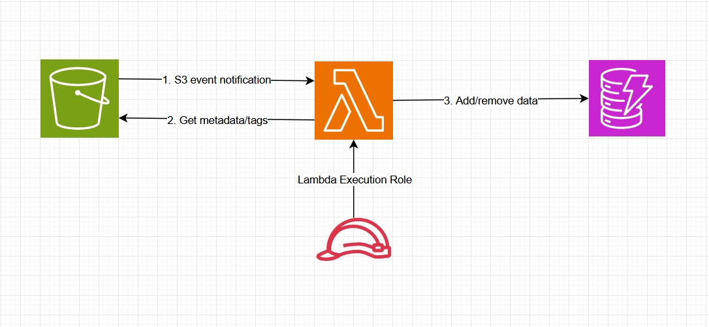

# S3 Object Metadata Loader

A serverless ETL utility that uploads S3 object metadata and tags in DynamoDB. When an object is uploaded or deleted in an S3 buckets, an AWS Lambda function is triggered to update the corresponding object details in DynamoDB.

## Overview

This project ensures that metadata and tag information of objects in an S3 bucket are automatically stored and kept in sync with a DynamoDB table. The Lambda function handles both object uploads and deletions, maintaining an up-to-date record in DynamoDB.

## Features

- **Automatic Synchronization**: Syncs S3 object metadata and tags with DynamoDB upon object upload and deletion.
- **Event-Driven**: Uses S3 event notifications to trigger AWS Lambda functions.
- **Serverless Architecture**: Built using AWS Lambda and DynamoDB for scalability and ease of maintenance.

## DynamoDB Table Schema

The DynamoDB table is named `S3_object_metadata` and has the following schema:

- **Partition Key**: `bucket`
- **Sort Key**: `key`

For each object, the following information is saved in DynamoDB:

- `bucket` (partition key)
- `key` (sort key)
- `region`
- `user_id`
- `size`
- `content_type`
- `timestamp`

## Architecture

1. **S3 Bucket**: Stores the objects. Configured to send event notifications to Lambda upon object creation and deletion.
2. **AWS Lambda**: Processes S3 events, fetches object metadata and tags, and updates DynamoDB.
3. **DynamoDB**: Stores the metadata and tag information of S3 objects.

